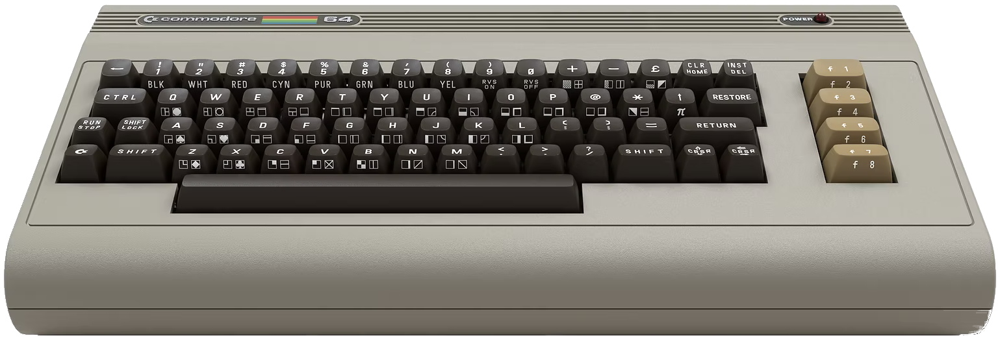
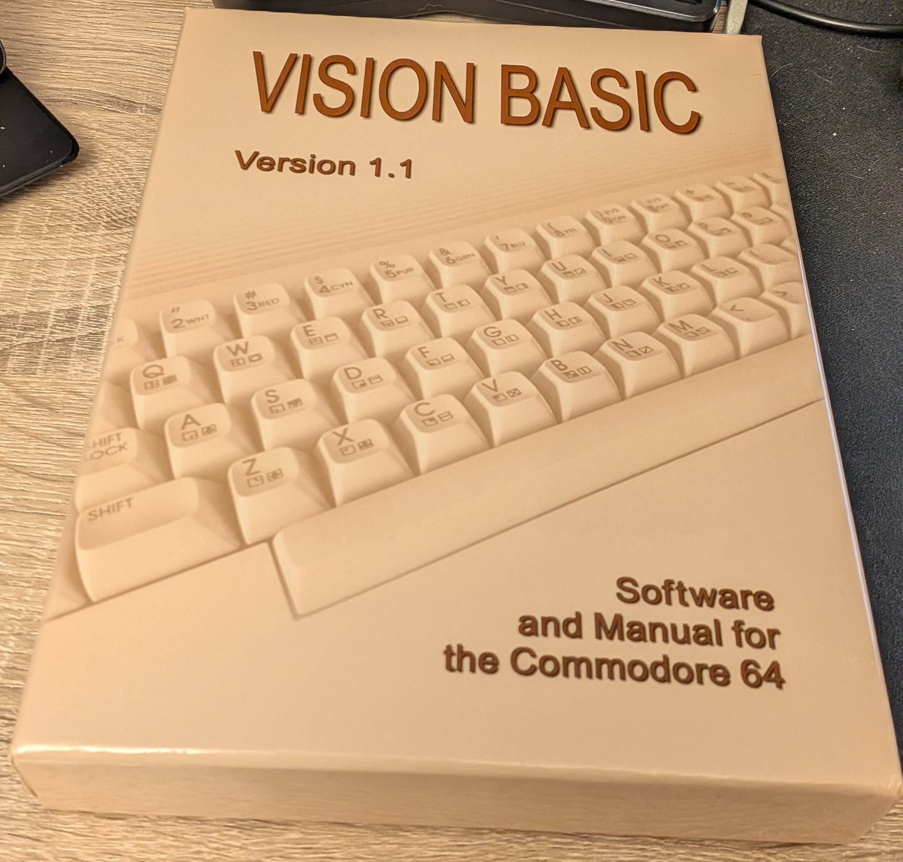
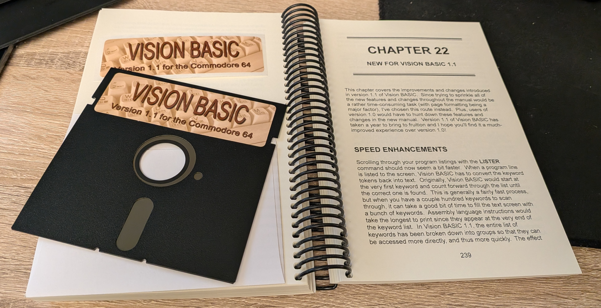
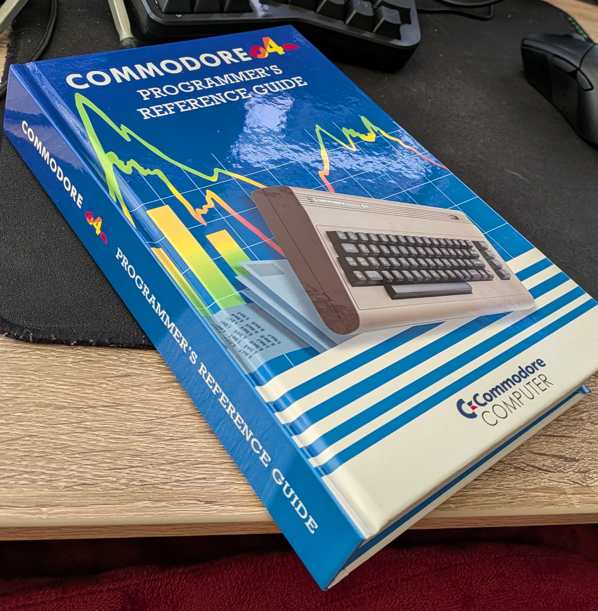

+++
date = '2026-02-28T11:04:17-08:00'
draft = true
title = 'Commodore 64'
+++

I came across an advertisement over the holidays about the [Commodore 64 Ultimate](https://www.commodore.net/product-page/commodore-64-ultimate-basic-beige-batch2). I was amused at the time and just thought that, while neat, it wasn't worth getting. They had a sale at the time that if you bought it at any point in 2025 it would cost $50 less as they were raising the price by $50.

Turns out, I could have saved $50.

It got into the back of my head and I kept thinking about it. It's obviously some really underpowered hardware compared to any modern electronics. With a 1 Mhz MOS 6510 and 64kb of ram, no modern OS could run on it. And yet, that limitation is intriguing.

I never had a Commodore 64 growing up, though I was exposed to them. In my Aunt's basement that I was often at as a child, they had one with a few games. At school, we used C64s to learn how to type before DOS and Windows eventually took over. I remember having an Intellivision (though my mom doesn't, so one of our memories is flawed), and later on an NES, Genesis, and eventually a Windows 3.11 PC. However, the Commodore was always a facinating machine to me, with its esoteric commands for loading programs and the `BASIC` prompt that invited one to not just run programs, but to write them as well.

There was a book I remember using when I was young that had a bunch of `BASIC` programs in it. I remember having my mom type in a program from that book which took hours (or maybe less.. I was young so 10 minutes probably felt like hours). In the end, it would create a picture of a house that had a chimney with smoke coming out of it. The smoke was animated and I thought it facinating that the words she typed somehow made an animated house. I don't think it was a Commodore 64, but it was some early computer that could run `BASIC` that you typed in, and lost when the computer was turned off. It was one of those early experiences that caught my imagination and made me want to work with computers for the rest of my life.

Today, computers and software are so advanced that they are starting to write themselves. Young people who have had access to computers all of their lives use them as utilities and understand a lot less about them than when I was a child. I suppose it makes sense, you don't need to know as much about them to use them any more. I think it's similar to how the generation before me really understood their cars and how they worked and how to fix them, and in my generation it became less common and today, even less so. When a technology is new, you need to know a lot about it to use it. Later, it gets streamlined and becomes easier to use and more commodified, and the required knowledge goes down.

Having access to a Commodore 64 in 2026 is an interesting proposition however. You're given that prompt. You have to know commands to load things. Programming a C64 requires patience and knowledge. You have to fit things in a small amount of memory. I'm sure you can vibe code your way to something, but assembly is tricky to work with and `BASIC` is pretty slow to run. Living in a world with such constraits makes it more interesting than the modern computers where we can throw enough CPU, RAM, and GPU at a problem until it's solved in a brute force sort of way. There's an elegance in conforming to those constraints.

In that regard, I've become interested in what was possible in 1982 using advancements in software that we've gained in the last 40 years. By that I mean, if you had only access to hardware of the C64 era, but access to software tools and knowledge of today, what could have been possible? That question led me to an interesting project. **Vision Basic**.

## Vision Basic
[Vision Basic](https://visionbasic.net/) is a facinating project written by Dennis Osborn and released in 2022. The purpose of it is to create a custom version of `BASIC` which compiles to native code in order to run `BASIC` programs faster. These actually existed back in the day in the form of the [Blitz](https://en.wikipedia.org/wiki/Blitz_BASIC), however **Vision Basic** also allows you to combine `BASIC` with assembly with some custom functions to make things easier to work with along with quality of life improvements like textual tags rather than using line numbers for everything. The whole thing runs on an actual Commodore 64 and is its own programming environment which is facinating to use compared to our modern systems.

Purchasing **Vision Basic** was an interesting experience. It's a piece of software for an old machine that you can only buy physically. It comes in a physical box with a physical manual and the software actually comes in a 5.25" floppy! Though there's also a USB with it in case you don't have a floppy drive like most people. It's so odd to recieve software in a physical box with a large physical manual (over 350 pages). While there is a way to get a digital download of **Vision Basic**, you can't actually get a copy of the manual digitally. Only in physical print. I think it's to reduce copying, but I also think it's just a good idea to have that feeling of how things were done with software back in the 80s and 90s.

The manual is facinating. It starts out describing how Vision Basic came to be originally in the late 90's as a personal project that Dennis worked on while sitting in hopsital waiting rooms as he had cancer. He had a lot of time on his hands and a notebook and so wrote portions of it while in that state. He stopped working it it after getting married and having children in the early 00's, but picked it up again in the mid teens. He describes wanting to use his favoriate language, `BASIC`, but have it run faster like assembly. And the piece of software that he made is remarkable. If you yourself pick up a Commodore 64 Ultimate and are interested in programming it, I would recommend giving it a go. Just the novalty of packaged software with a real manual is itself a treat, but the language and compiler itself are quite extraordinary.

## Programming The Commodore 64

As I've stated, part of my facination with the Commodore 64 in 2026 is as a programmer. It is something that I think I can appreciate now so much more than I would have had I had one when I was a child. I've been a programmer for over 20 years now, so that experience makes the limitations of the device more interesting to me than I think it would have when I was young. Beyond **Vision Basic**, the Commodore 64 comes with 2 main ways to program it that were included with the device itself. The first is of course `BASIC` which loads every time you turn it on. The second is MOS 6502 assembly. The chip in the C64 was a MOS 6510, but it's compatible with 6502 and that's the version of assembly that was used.

When you bought a Commodore 64, it came with a fairly large spiral bound user manual. That manual contains not only the operating instructions for the computer, but also a primer on `BASIC` programming. It did not touch on assembly however, being a device primary ment for hte home. However, a similar book was created that one could buy called *Commodore 64 Programmer's Reference Guide*. Unfortuantely these are rare to find and often in pretty bad shape. However, a wonderful individual in Scottland who has a site called [Pickled Light](https://pickledlightprojects.com/) has recreated the *Programmer's Reference Guide* and *User's Guide* in a printable PDF along with [instructions](https://pickledlightprojects.com/documents/c64-guides/) on how to have the professional printed for relatively little cost. He reformatted all of the original text in order to be printable. I did this myself and the results are pretty remarkable.

All of this old tech and programming practices are facinating to someone who didn't experience them as the main way of interacting with a computer. I don't know what types of programs I plan to make for the Commodore 64, or if I'll even finish any that I start, but I do know that I'll find it interesting to partake in the journey of learning about it.