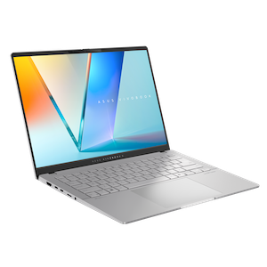
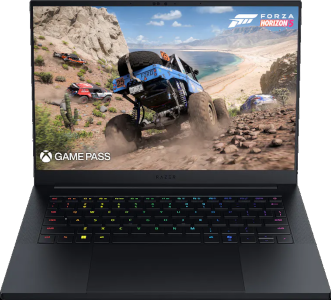
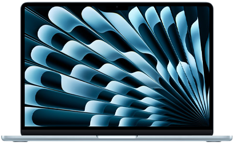

+++
title = 'Hardware'
date = 2025-09-09T13:45:00-08:00
categories = ['dev']
tags = ['gamedev']
author = 'Colin'
+++

Day to day, I normally use my desktop for game dev along with any other programming and gaming that I do. However, there are times where it is useful to be able to have a portable machine so that I'm not at my desk for 8 hours at work followed by another several hours doing my hobbies. This necessitates a laptop, which is also handy for if I ever want to travel.

I have two laptops, which one would think would be enough. I have a 2021 Razer Blade 15" which has an NVidia 3080. It's still pretty powerful for being 4 years old and can play almost any modern game. It also has fans that sound like a jet engine, gets as hot as lava in my lap necessitating a cooling pad, and has a battery life measured in minutes. To contrast that I also have a 13" Surface Pro. It's pretty zippy honestly as long as you're not gaming and has a battery life measured in hours. It does get hot, but only on the display since it's mostly a tablet and I have an attached keyboard which produces no heat. Unfortunately, the kickstand it uses is terrible for a lap and windows on arm does have some compatibility issues. I do still like it, but I wanted something that didn't annoy me as much for usability so I went on a search for laptops and did some experiments along the way.

# The Contenders

I ended up purchasing 3 laptops for this project. 2 of which I returned, and one of which I decided to stick with. For this experiment I purchased an [Asus Vivobook 14S](https://shop.asus.com/us/90nb14p3-m002l0-asus-vivobook-s-14-oled-m5406.html), a [Razer Blade 14](https://www.razer.com/gaming-laptops/razer-blade-14), and a [Macbook Air M4](https://www.apple.com/macbook-air/). Since I wanted to use some objectivity, I decided to come up with a list of what was important to me and rate the levels of importance of each item. I then did experiments with each machine (almost), and evaluated what most met my requirements.

## The Requirements

Over the years, my priorities have shifted.  Or rather, my ability to meet certain priorities have changed what my priorities are for this particular laptop. In the past, I really wanted power. I wanted something that would be fast and be able to do anything I wanted without being slowed down. This is exemplified by the Razer Blade 15 I currently own. It's still fast, even 4 years later. This comes at the cost of portability and battery life. After I purchased the Surface Pro, I started to realize the benefits of a fast enough computer with good battery life. Having great battery life is life changing for a laptop in a way I didn't expect. Often, if I didn't fully shut down or keep plugged in the Blade, it wouldn't turn on when I wanted it to because it was completely drained. The Surface Pro turns on even weeks after having only shut the lid with still a decent amount of battery. However, the surface pro did stumble sometimes on turning on, taking a long time or having troubles even recognizing that I was trying to get it to start. Also, as previously mentioned, it wasn't very comfortable to use. In addition, compatibility issues are also something that is frustrating to deal with.

My list of requirements in order of importance is thus:

1. Battery Life - Measured in Hours, not Minutes. Retains battery when the lid is closed.
2. Size - It has to be small enough to fit into my bag.
3. Compatibility - Must be able to handle all primary use cases and most secondary use cases.
4. Speed - Must be fast enough to handle my use cases without hiccup.
5. Heat - Can't get too hot, even under load. Mostly this will tie to battery since heat drains battery.
6. Comfort - Must be comfortable to use both on a desk and in a lap.
7. Build Quality - Should feel sturdy and not breakable.

Battery life was the most important thing. Having had a powerful gaming laptop that dies almost instantly when not plugged in and comparing it to a laptop that lasts for hours, I know that I prefer the one that lasts for hours. For compatibility, I have to look at my use cases. I'm a very large gamer and I think previously my primary use case would be for gaming. For this laptop, gaming is still a use case, but a secondary one. The primary use case is programming. Specifically, I wanted a machine that will be good for programming 2D games in [Godot](http://www.godotengine.org) using [Rider](https://www.jetbrains.com/rider/) as my IDE. It also needs to be able to be used to work on and publish this blog as I want to write more often.

My secondary use case is still gaming and also still important. A dedicated graphics card isn't as necessary as it was in the past because I can run most games with [GeForce Now](https://www.nvidia.com/en-us/geforce-now/). However, I'm recently playing a lot of [Final Fantasy XIV](https://na.finalfantasyxiv.com/) which isn't on GeForce Now so that game needs to run. Also it would be good if it could at least run standard indie games locally that aren't too taxing on both [Steam](http://www.steampowered.com) and [Epic Games](https://www.epicgames.com).

For speed, we just need something that feels generally fast. My main use case is programming and that's mostly text editors and the Godot Engine, neither of which is really taxing. The speed part mainly will come into play on the secondary use case of gaming, specifically in FFXIV. I also don't want the machine burning my lap, so I did some temperature readings when doing something intensive.

The tests needed to be performed mainly sitting on a couch which is one of the places where the Surface Pro fails at. It has to be comfortable to hold and use. And ideally not feel flimsy and breakable, but that one is more of a tie breaker. Price isn't on this list, but my range was between $1k and $2.5k, with lower obviously being better.

Now, onto the different machines!

# Asus Vivobook 14S

I was able to find a really good deal on the Vivobook at Staples of all places. It was $350 off which brought it in to under $1k. One of the things I liked about this machine was that it used an AMD Ryzen AI 365. The new AI chips are said to be very good on battery while also being quite snappy. It also has an NPU for if I want to play around with locally running AI models which maybe I'll do in the future.

My first experiment was to do some Godot programming for a few hours and check on where the battery was. I was using 4.4 of the Godot Engine along with JetBrains Rider as my IDE. I'm working on a new game that I'm not yet ready to talk about, but I was able to put in a solid 2 hours. I started at **97%** battery and ended at **71%**. This meant in 2 hours I had a **26%** battery drain for a working battery that is roughly 8 hours doing game programming. That's a whole day, which is more than I would typically spend doing game programming so the battery for my primary use case was good.

I did run into some issues though. The touchpad was really hard to work with in Godot. If I wanted to pan a scene, I couldn't just use two fingers on the touchpad to pan around, it would instead try to zoom. I had to use the scroll bars which is not pleasant or use a mouse. The keyboard felt good though and there were no compatibility issues as one would expect with an x86 CPU running Windows.

I did an additional set of tests where I would close the lid and record the time and battery percentage, wait several hours or days, then open up the lid and see how much drain there was. That first day I closed the lid at **71%** and opened it again 22 hours later and the battery was at **66%**. That means there was only a **5%** drain in that 22h period. I did th same test again for only 8 hours and lost **4%**. I assume that the machine is going into hibernate after a period of time and so is effectively off. It seems like 4-5% loss is expected to reach hibernation and then standard battery drain while a computer is off takes over, which is much slower. I had done this same test on my old Razer Blade 15 and it lost 40% over night so this is a big improvement.

I also recorded the rate of charging and it seems to charge at the rate of about **1% per minute**. This of course varies with how drained the battery is, but it seems reasonable to charge an entire laptop in a bit over an hour and a half. Usually less because we try not to run the battery to 0%.

The build quality of the machine was ok, but not great. The screen felt a bit flimsy and almost like it has a hollow spot and it collected fingerprints immediately on the black surface. Still, it was perfectly usable and I doubt it would just break under my hands.

## Vivobook with FFXIV
My primary use case was a success, so now I wanted to look into the secondary use case of playing games. I installed FFXIV which took quite a while and surprisingly caused the machine to get pretty hot. It was plugged in at the time, but the underside of the laptop got to between **110˚F** and **120˚F**. It wasn't exactly burning my lap, but it was starting to get a bit uncomfortable.

Inside of the game, I was able to achieve 60FPS by setting the screen resolution to 1600x1000 with the settings at Laptop (low). I played for 10 minutes and noticed an 11% battery drain. So gaming takes about 1% per minute giving about an hour and a half game time on battery. I expect it to be plugged in while gaming, but it gives a good idea of how long the battery will last under heavy load. The game did have some noticeable aliasing, but was snappy to play and worked well enough.

# Razer Blade 14

Because I liked my original Razer Blade 15, I thought it would be prudent to look into the new Razer Blade 14. It's smaller, and has the same AMD AI 365 as the Asus Vivobook 14S. The chip is significantly more power efficient and I thought that if one could use NVidia Optimus or disable the discreet graphics card (the blade ran a 5070), then maybe I could get the power that I'm used to along with a battery life that's no longer measured in minutes.

There's a Razer Store near me so I decided to pick it up there as it would be easy to return after running tests. Unfortunately, the in person Razer Store has a 15% restocking fee for any computer that's even opened and then returned. That means on this machine that runs for around $2400, it would cost $360 to open it up and run any of the tests. It sat in my living room while I ran the Vivobook tests and I did a lot of online research on the Blade 14 during that. From what I could discover, while it definitely had better battery life than the 4 year old Blade 15 that I already owned, it would still have a battery life measured mostly in minutes or a very small number of hours.

The Vivobook had reviews that said in basic office tasks the battery life would last 17 hours. I did a real world test on my use case and found it would probably last around 8 hours. The Razer Blade 14 had those same office tests showing 6 hours of use. That means my use case would probably last only 3. Even if I somehow got the full 6, that's still far below the Vivobook. While I know the build quality will be much higher on the Razer and that gaming will easily be better, the battery life is still my top consideration and I didn't see a world where it met up to what I was already looking into. So I brought it back without opening it to get a full refund. No real tests were run, but it seems unlikely they would have mattered.

# MacBook Air 13

At first I had no intentions of looking into MacBooks at all. My 3rd requirement, compatibility, would suffer greatly. I have to use a Mac at work and while it's fine for most things, there are a lot of aspects around Mac OS itself that I heavily dislike. The command key rather than control being used for most keyboard shortcuts is annoying. The fact that the maximize button does a full screen maximize rather than just making a window bigger is terrible. Most games do not work on a Mac by default, though some do. Also, the system is really based around you owning all apple products like an iPhone, and I'm an Android dev so I only own Android devices.

That being said, while doing research, it's hard to deny the battery life of a MacBook with Apple Silicon. Reports of 20+ hours; multiple days of battery life is appealing. Also, the M4 chip isn't exactly slow, having good performance in a lot of benchmarks and real world tests. It would be silly of me to not test this laptop and see if all of the positives could overcome the compatibility negatives or if I could find workarounds for the negatives.

The first thing I noticed upon opening up the box for the MacBook Air was just how good the build quality was of the physical machine. It's thin, solid metal, fairly light, and feels really good in the hands even closed. That was suddenly a larger positive than I expected. While I've used a mac daily for the last 5 years, it's almost always while hooked up to monitors and an external keyboard and mouse. I don't use my work laptop as a laptop. Also, that one is a MacBook Pro which is way heavier and clunkier. The Air is very svelte, and seems like a really good portable companion.

For the batter I did the same set of tests that I did on the Vivobook. While I didn't have time to do Godot programming, I instead measured out 2 hours of installing apps and using it fairly constantly. Having the radio in constant usage downloading along with decompressing files I thought would still provide a good battery test. In 2 hours the Air went from **71%** battery to **51%**. That's roughly **10% per hour** which would put the usable life at 10 hours, 2 higher than the Vivobook. When I closed the lid and left the Air for 12 hours, it used 0% battery. Later tests had it still use a few percentage points (I think no more than 4%), but it was pretty minimal

One additional note about closing the lid. No matter how long I left the device closed, turning the time to open it and get back into a usable state was around 2 seconds. Most of that just being the time it takes to put my finger over the fingerprint sensor. For the Vivobook (and even my surface pro), which both use Windows Hello, they required to be turned back on with a button due to hibernate and took about 42 seconds to turn back on. That instant usability was pretty amazing.

I also did install Godot and Rider and did a little bit of work in it and everything worked really well. In fact, the Godot Editor was better on a mac because my touchpad was able to pan by scrolling with two fingers. I could pinch to zoom still so the editor interface for 2D was miles above where I was on Windows; an unexpected boon. The blog software for this blog was also easy to install; in fact it was easier than on Windows since the Mac with homebrew seems to work better for things like Ruby and Jekyll than Windows on the command line. Aseprite runs natively on the Mac and again, the touchpad controls for panning and zooming are a lot better than Windows.

On most of my machines, I remap caps lock to act like control. I think a dedicated caps lock key is a waste of real estate on a keyboard. I remapped the caps lock key on the mac to be command. I use it like I would control, and most apps with keyboard shortcuts for Mac use command rather than control so things like copying, pasting, select all, etc all work with muscle memory in the same way. It helps me get around my annoyance of the command key.

For maximizing windows, I already owned a copy of [BetterSnapTool](https://apps.apple.com/us/app/bettersnaptool/id417375580?mt=12) which I can use to drag an app to the top of the screen to maximize rather than using the button. It's a good enough solution to now just ignore the full screen button and slam screens to the top (or sides) of the screen to resize them.

With that, my primary use cases were actually covered.

## FFXIV on a Mac
My gaming secondary use case now would need to be tested. While FFXIV has a Mac client, it is actually an x86 client that uses Rosetta 2. I attempted to install and use it, and unfortunately the updater ran into an install loop where it would fail to update. I almost gave up until I learned about [XIV on Mac](https://www.xivmac.com/). It's basically an alternate launcher that works better on Apple Silicon. And it did work which was fantastic. I decided to load up the game and do another 10 minute test while on battery.

I was able to get a solid 60FPS (sometimes higher and into the 70s) at 1710x1112, which is a little higher resolution than the Vivobook. I also was able to use higher settings so the aliasing was less noticeable and the game overall looked better. I used an external mouse, and I did notice a little bit of sluggishness to the response compared to the Vivobook. I assume it's because the game is still using a translation layer so there is input lag compared to a Windows machine. Not unplayable, but subconsciously noticeable. There were also times that it had a little bit of jitter. The game looked better and on paper the performance was better, but the input lag probably made it on par with the Vivobook overall.

Battery wise in the mere 10 minutes I ran the game I lost 6% battery. A significant improvement over the Vivobook. I realize it's not a long time, but I wanted to do just a short consistent test. It seems like it would play FFXIV pretty well.

But what about other games? Most games are not supported on Mac which is disappointing, but there are two tools to improve the the experience. The first of course, is GeForce Now. I played some [Enshrouded](https://store.steampowered.com/app/1203620/Enshrouded/) for over an hour and only lost about 5% of battery. Playing high end games with game streaming is incredibly power efficient as long as the network is good. I had a few places where it slowed down, but for the most part played fine.

The second tool I discovered is Codeweavers [Crossover](https://www.codeweavers.com/crossover). This let me install the Windows version of Steam and Epic and run Windows versions of games using a Wine compatibility layer. It's more emulation, but for less demanding games it works quite well. I was able to play [Master Duel](https://store.steampowered.com/app/1449850/YuGiOh_Master_Duel/) which I play a lot of. I also installed Epic and was able to try out Genshin Impact which seemed to work fine.

The combination of the Mac version of Steam/Epic, along with Crossover and GeForce Now gives me enough gaming options that I feel like I can accept the Mac as an option. Primarily I'd be gaming on my desktop, living room pc, or steam deck anyway, this is just a nice additional option if it's what I have available.

# Conclusion
Battery life was my biggest concern and ultimately both the Vivobook and MacBook Air fit the bill. While the Vivobook has better software compatibility, the touchpad usability in my main apps combined with superior battery life and better performance pushed the MacBook over the top. I was also impressed by how fast the MacBook Air comes alive from a sleeping state while using very minimal battery. The ability to be instantly awake when I pick it up is a really nice feature to have. I'm still returning all of the computers that I bought and I'll be buying a different MacBook Air with a larger hard drive (the test machine only have 512GB), but it seems like the best machine for my use case. This was surprising to me, but I'm glad I did the testing to truly know what would work best. It's possible something like a Surface Laptop would have also worked as I do like my Surface Pro for battery and speed, but having a different platform does open up some more possibilities.

I wrote this on my test version of the MacBook Air and it's working quite well.

That was my journey on how I chose my new Godot development laptop. Other people may have different requirements but this was mine. I would recommend the Vivobook still, but I really do want those Windows machines to get better touchpad support and better battery life still.
